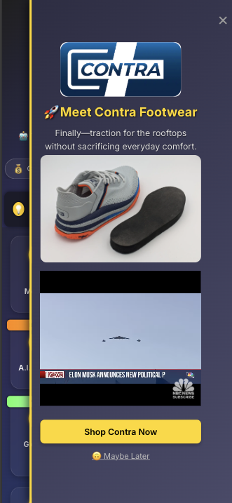
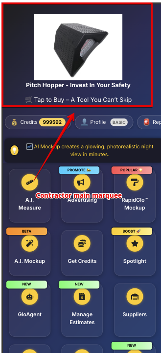
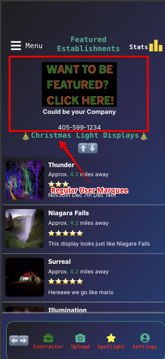
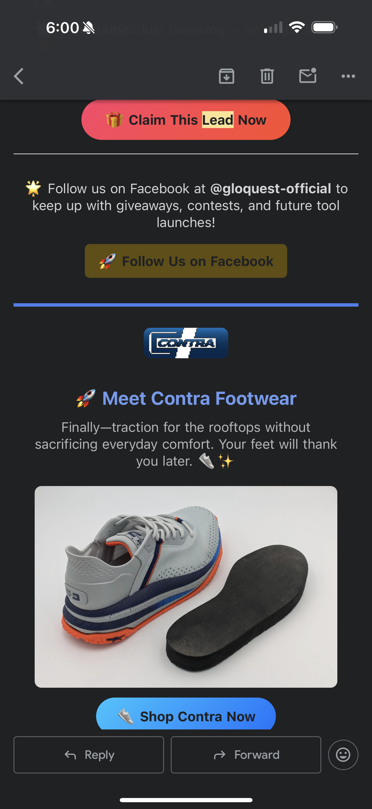
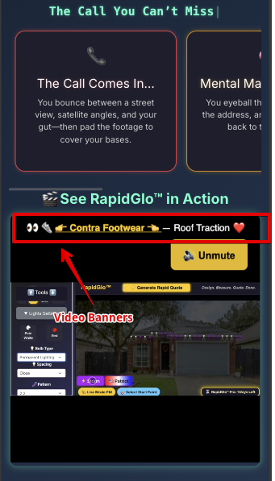
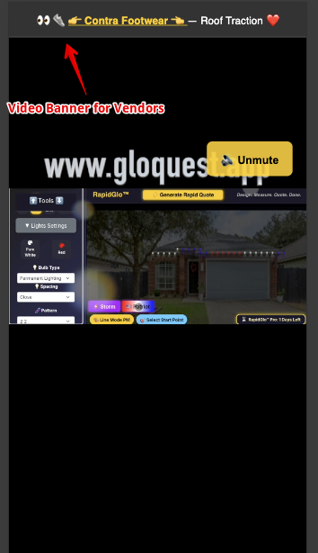

⸻

# 🤝 Partner With GloQuest

**No fees. No fluff. Just visibility, exposure, and growth — together.**

⸻

## 📌 Who Is GloQuest?

GloQuest is the nation’s fastest-growing platform for festive discovery, design, and decoration.

We connect homeowners, professional Christmas light installers, and top-tier product vendors under one ecosystem designed to drive sales, increase exposure, and delight end users.

### 🎄 For Installers:

- 🚀 AI-powered mockups and smart measurements
- ⚙️ Business automations for quote generation, follow-ups, and job tracking
- 💬 Built-in messaging and customer pipeline tools
- 📊 Quote and close jobs faster with higher conversion rates

### 🏡 For Homeowners:

- 🔍 Search and view the largest directory of holiday light displays
- 🎨 Visualize their home with light mockups before they buy
- 📲 Connect directly with verified contractors and browse featured vendors

### 🤖 Our Advantage

We’re not just tech-friendly — we’re AI-powered.  
GloQuest incorporates artificial intelligence into:

- Instant visual rendering of lighting designs
- Auto-measuring rooftops and ridgelines
- Generating real-time quotes with just a photo

We’re already transforming the seasonal decor industry — and we’re just getting warmed up.

⸻

## 🖼️ In-Platform Vendor Visibility

Vendors don’t just sit in a directory.  
They’re actively featured across the GloQuest platform at high-impact moments.

**App-wide Slide-In Promotions**  

**Marquee Banner Exposure (Contractor Dashboard)**  

**Marquee Banner Exposure (Regular Users)**  

**Email Campaigns + Mentions**  

**Video Banners During Quotes + Demos**  
  

⸻

## 💡 Why Partner With Us?

You're not just renting space — you're getting positioned in front of motivated buyers **at the perfect time**.

Our platform isn't static. Vendors are seen across:

- 🎯 Slide-in promotions that occur in 8-minute intervals
- 🧲 Marquee banners during peak usage hours
- 📩 Email campaigns and user onboarding
- 📱 Mass text broadcasts to verified contractors
- 📺 In-app video banners during quoting/demo processes

We’re not a directory. We’re a **conversion engine**.

⸻

## 🎖️ Vendor Tiers

### 🥇 Gold Vendor

**🎁 Benefits:**

- Top placement in vendor directory
- Featured product integrations (mockups/tool embeds)
- Dedicated ad slot on contractor dashboards
- Monthly analytics report

**📣 Expectations:**

- Feature us on your site, mention us on socials/blog, or signage in-store (we provide!)

---

### 🥈 Silver Vendor

**🎁 Benefits:**

- Secondary placement
- Rotating ad banner exposure
- Quarterly analytics

**📣 Expectations:**

- Display a GloQuest flyer/QR sign and one social media mention

---

### 🥉 Bronze Vendor

**🎁 Benefits:**

- Priority placement above basic listings

**📣 Expectations:**

- Link back to GloQuest from your website

---

### 🪙 Basic Vendor

**🎁 Benefits:**

- Listed in our public-facing supplier directory

**📣 Expectations:**

- No action — just request a listing

⸻

## 🌎 Where Will You Be Seen?

Right where contractors work:

- Inside the mockup tool (our most-used feature)
- On contractor dashboards while they quote jobs
- In our Festive Resource Center for both installers and homeowners

You’ll appear during the highest-conversion moments of our platform.

⸻

## ⏰ When Should You Join?

**Now.**

We’re scaling rapidly — doubling our installer base every season.  
Early vendors get front-row positioning and higher click-through rates.

We’re preparing for a **massive push this holiday season**, and the **top 5 vendors** will receive additional feature exposure.

⸻

## ❓ Frequently Asked (and Answered)

**Do I need to pay?**  
No. This partnership is free and built on mutual growth.

**Will I know if it’s working?**  
Yes. Every vendor link comes with UTM tracking, and we share optional traffic + interest reports monthly.

**Can I target only installers or homeowners?**  
Absolutely. We tailor placements based on your audience.

⸻

## 📣 Ready to Get Started?

Let’s start a conversation. Whether you’re a small business or a national brand, we’ll craft a placement that works for both of us.

📅 **Schedule a call or email us** at [vendors@gloquest.app](mailto:vendors@gloquest.app)

Let’s light up the holidays — together.
